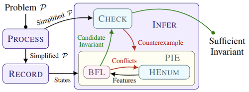

LoopInvGen
  [][travis]
  [][docker-hub]
==========

A data-driven tool that generates provably-sufficient loop invariants for program verification.

<p align="center">
  
  <br><br>
  <small>[<code>LoopInvGen</code> is the successor of the <a href="https://github.com/SaswatPadhi/PIE"><s>old PIE project</s></a> (now deactivated).]</small>
</p>


---

[**Installation**](#installation)
&nbsp; &nbsp; &vert; &nbsp; &nbsp;
[Invariant Inference](#invariant-inference)
&nbsp;&middot;&nbsp;
[Batch Verification](#batch-verification)
&nbsp; &nbsp; &vert; &nbsp; &nbsp;
[_Use as a Library_](app/)
&nbsp; &nbsp; &vert; &nbsp; &nbsp;
[Citing `LoopInvGen`](#citing-loopinvgen)
&nbsp;&middot;&nbsp;
[License (MIT)](LICENSE.md)

---

#### :page_with_curl: Papers and Presentations

- [PLDI 2016](http://conf.researchr.org/home/pldi-2016) -
  Original [paper on PIE](http://saswatpadhi.github.io/assets/pdf/pldi2016_pie.pdf) (Precondition Inference Engine), the backbone of LoopInvGen
  <br><br>
- [SyGuS-COMP 2018][SyGuSCOMP18] (a satellite event of CAV and SYNT at FLoC 2018) -
  Solver [Presentation](docs/2018_SyGuS-COMP-Presentation.pdf) and [Description](docs/2018_SyGuS-COMP-Description.pdf)
- [SyGuS-COMP 2017][SyGuSCOMP17] (in conjunction with CAV and SYNT 2017) -
  Solver [Presentation](docs/2017_SyGuS-COMP-Presentation.pdf) and [Description](docs/2017_SyGuS-COMP-Description.pdf)

#### :trophy: Awards and Honors

- :1st_place_medal: [SyGuS-COMP 2018][SyGuSCOMP18] - INV Track **Winner** ([Presentation](http://sygus.seas.upenn.edu/files/sygus-comp18.pdf))
- :1st_place_medal: [SyGuS-COMP 2017][SyGuSCOMP17] - INV Track **Winner** ([Presentation](http://sygus.seas.upenn.edu/files/sygus-comp17_results.pdf) and [Report](http://sygus.seas.upenn.edu/files/SyGuSComp2017.pdf))

## Installation

### Using `docker` (recommended)

_**Note:** The docker image consumes ~4GB of disk space._

We recommend running LoopInvGen within a docker container,
as opposed to installing it within your host OS.
Docker containers have negligible performance overhead.
(See [this report](http://domino.research.ibm.com/library/cyberdig.nsf/papers/0929052195DD819C85257D2300681E7B/$File/rc25482.pdf))

1. [Get `docker` for your OS](https://docs.docker.com/install).
2. Pull our docker image<sup>[#](#note_1)</sup>: `docker pull padhi/loopinvgen`.
3. Run a container over the image: `docker run -it padhi/loopinvgen`. This would give you a `bash` shell within LoopInvGen directory.

<a name="note_1"><sup>#</sup></a> Alternatively, you could also build the Docker image locally:

```bash
docker build -t padhi/loopinvgen github.com/SaswatPadhi/LoopInvGen
```

<details>

<summary> Docker also allows you to easily limit the container's memory and/or CPU usage.</summary>

```bash
# Create a LoopInvGen container with 4GB memory, no swap and 1 CPU
$ docker run -it --memory=4g --memory-swap=4g --cpus=1 padhi/loopinvgen
```

See [the official Docker guide](https://docs.docker.com/config/containers/resource_constraints)
for more details on applying resource constraints.

</details>


### Manual Installation

<details>

<summary><kbd>CLICK</kbd> to reveal instructions</summary>

#### 0. Get the required packages for your OS.

Please see the [`Dockerfile`](Dockerfile#L19-L21) for the complete list of required packages
for building LoopInvGen and its dependencies.  
Most of these packages are already installed on standard installations of most *nix distributions,
except, may be, these: `aspcud libgmp-dev libomp-dev m4`.

#### 1. Install `ocaml` >= 4.04.2.
We recommend using an OCaml compiler with [`flambda`][flambda] optimizations enabled.
For example, with [`opam`](https://opam.ocaml.org/), you could:
- run `opam switch 4.07.0+flambda` for opam 1.x
- run `opam switch create 4.07.0+flambda` for opam 2.x

#### 2. `opam install` the dependencies.
```bash
$ opam install alcotest.0.8.3 core.v0.11.3 core_extended.v0.11.2 dune.1.2.1
```

#### 3. Get the [Z3 project][z3].
We have tested LoopInvGen with the latest stable version of Z3 (4.7.1).
You could either:
- `git checkout https://github.com/Z3Prover/z3.git` for the bleeding edge version, or
- `wget https://github.com/Z3Prover/z3/archive/z3-4.7.1.zip && unzip z3-4.7.1.zip` for the stable version

#### 4. `git clone` this project, and build everything.
```bash
$ ./build_all.sh -z /PATH/TO/z3_dir
```
The `build_all.sh` script would build Z3, copy it to `./_dep/`, and then build LoopInvGen.
Alternatively, you can copy a precompiled version of Z3 to `./_dep/`, and simply run `./build_all.sh`.

For debug builds, use the `-D` or `--debug` switch when invoking `./build_all.sh`.

For future builds after any changes to the source code, you only need to run `dune build`.
You can configure the build profile to either `debug` or `optimize` (default),
using: `dune build --profile <profile>`.  

</details>

## Invariant Inference

Infer invariants for SyGuS-INV benchmarks by invoking LoopInvGen as:
```bash
$ ./loopinvgen.sh benchmarks/LIA/2016.SyGuS-COMP/array.sl
(define-fun inv-f ((x Int) (y Int) (z Int)) Bool (not (and (>= x 5) (not (<= y z)))))
```

**Note:** LoopInvGen processes benchmarks in multiple stages.
We trap <kbd>CTRL</kbd>+<kbd>C</kbd> (`SIGINT` signal) to break out of the current stage,
and <kbd>CTRL</kbd>+<kbd>\\</kbd> (`SIGQUIT` signal) to kill LoopInvGen and with its child processes.

#### Inference Timeout

You may use the `-t` flag to run LoopInvGen with a maximum limit
on the number of _seconds_ (wall-clock time) for which the inference algorithm may run.
```bash
$ ./loopinvgen.sh -t 8 benchmarks/LIA/2016.SyGuS-COMP/array.sl
```

For timeout based on CPU time, you may use [`ulimit`](https://ss64.com/bash/ulimit.html).

<details>

<summary><kbd>CLICK</kbd> for further details</summary>

#### Verifying Generated Invariants

The `-v` switch makes LoopInvGen verify the benchmark with the generated invariant:
```bash
$ ./loopinvgen.sh -v benchmarks/LIA/2016.SyGuS-COMP/array.sl
PASS
```

It gives one of the following verdicts:
```
PASS                : The generated invariant successfully verifies the benchmark.
PASS (NO SOLUTION)  : The benchmark is invalid (no invariant can verify it),
                      and no invariant was generated.
FAIL {<vc1>;...}    : The generated invariant fails to verify the VCs: vc1, vc2 etc.
                      where each VC is one of {pre, post, trans}.
FAIL (NO SOLUTION)  : The benchmark is invalid (no invariant can verify it),
                      but an invariant (that is not empty/false) was generated.
[TIMEOUT] <verdict> : Invariant inference timed out.
                      With an empty (false) invariant, <verdict> is one of the verdicts above.
```

Try `./loopinvgen.sh -h` for other options that allow more control over the inference process.

</details>


## Batch Verification

Execute `./test_all.sh -b benchmarks/LIA` to run LoopInvGen on all benchmarks in [benchmarks/LIA].  
The `test_all.sh` script invokes LoopInvGen for invariant inference,
and then verifies that the generated invariant is sufficient to prove correctness of the SyGuS benchmark.

**Note:** Within `test_all.sh`,
we trap <kbd>CTRL</kbd>+<kbd>C</kbd> (`SIGINT` signal) to kill the currently running benchmark,
and <kbd>CTRL</kbd>+<kbd>\\</kbd> (`SIGQUIT` signal) to kill the `test_all.sh` script with its child processes.

<details>

<summary><kbd>CLICK</kbd> for further details</summary>

For each benchmark, the `test_all.sh` script generates one of the verdicts mentioned [above](#verifying-generated-invariants), or:
```
[SKIPPED] <verdict> : Invariant inference was skipped for an already passing benchmark.
                      <verdict> is one of the PASS verdicts above.
```

#### Caching of Results

Since `test_all.sh` caches results from previous runs, it skips benchmarks that are known to be passing.  
This may be disabled by:
- using the `-r` or `--rerun-passed` switch with `test_all.sh`, or
- deleting the previous log directory (default: `_log`), or
- specifying a new log directory (`-l _new_log`).

#### Benchmarking with Other Inference Tools

`test_all.sh` is a generic benchmarking script that may run any invariant inference tool.
which accepts the SyGuS format. This makes it easier for us to compare various tools easily.  
To use an invariant inference tool other than LoopInvGen, invoke it as:
`test_all.sh -b <path/to/benchmarks> -T <path/to/tool> [-- -tool -specific -options]`

#### Limiting Execution Time

Just like `loopinvgen.sh`, the `test_all.sh` script allows users to limit the
execution time for the invariant inference tools using the `-t` flag.
```bash
$ ./test_all.sh -b benchmarks/LIA -t 10
```

Try `./test_all.sh -h` for more options.

</details>

## Citing `LoopInvGen`

```
@inproceedings{DBLP:conf/pldi/PadhiSM16,
  author    = {Saswat Padhi and Rahul Sharma and Todd D. Millstein},
  title     = {Data-driven precondition inference with learned features},
  booktitle = {Proceedings of the 37th {ACM} {SIGPLAN} Conference on Programming
               Language Design and Implementation, {PLDI} 2016, Santa Barbara, CA,
               USA, June 13-17, 2016},
  pages     = {42--56},
  year      = {2016},
  crossref  = {DBLP:conf/pldi/2016},
  url       = {http://doi.acm.org/10.1145/2908080.2908099},
  doi       = {10.1145/2908080.2908099},
  timestamp = {Mon, 27 Jun 2016 07:33:52 +0200},
  biburl    = {https://dblp.org/rec/bib/conf/pldi/PadhiSM16},
  bibsource = {dblp computer science bibliography, https://dblp.org}
}
```

[flambda]:        https://caml.inria.fr/pub/docs/manual-ocaml/flambda.html
[z3]:             https://github.com/Z3Prover/z3
[benchmarks/LIA]: benchmarks/LIA

[SyGuSCOMP17]:    http://www.sygus.org/SyGuS-COMP2017.html
[SyGuSCOMP18]:    http://www.sygus.org/SyGuS-COMP2018.html

[travis]:         https://travis-ci.org/SaswatPadhi/LoopInvGen
[docker-hub]:      https://hub.docker.com/r/padhi/loopinvgen
